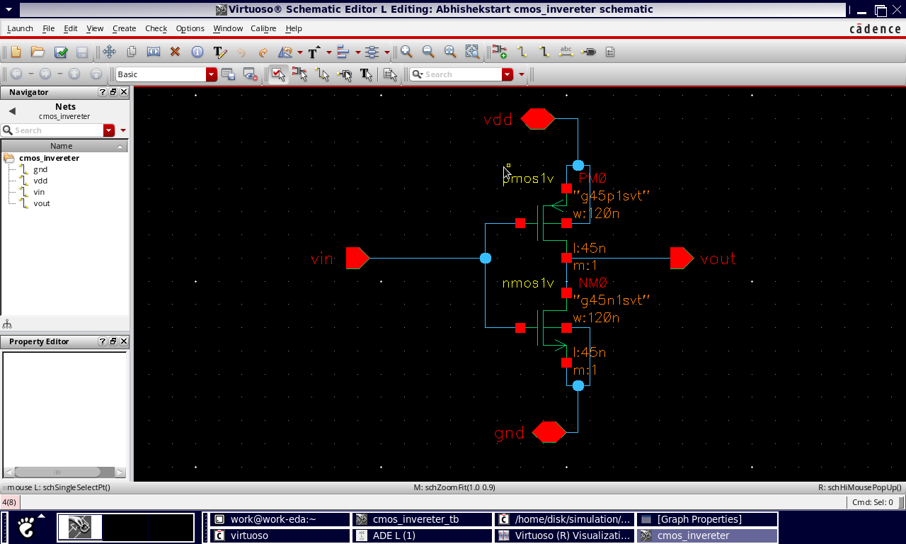
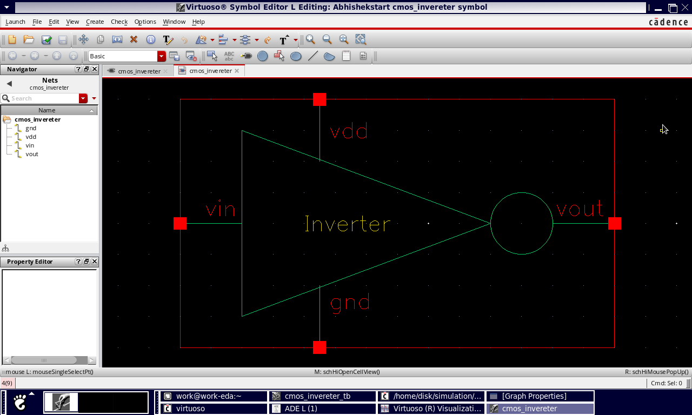
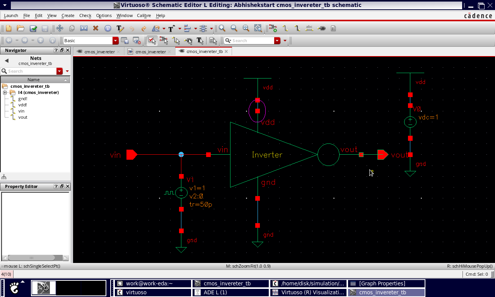
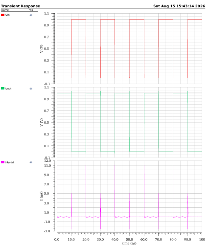
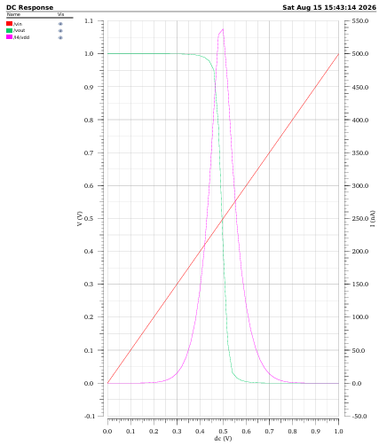

## 📌 Project Overview

This project demonstrates the design and simulation of a **CMOS Inverter** using **Cadence Virtuoso**. The project focuses on transistor-level CMOS circuit design, schematic creation, simulation, and analysis of the inverter's electrical behavior.

A CMOS inverter is one of the fundamental building blocks of digital VLSI circuits and is used as the basis for more complex logic gates and digital systems.

## 🎯 Objectives

* Design a CMOS inverter using PMOS and NMOS transistors.
* Create and verify the transistor-level schematic.
* Simulate the CMOS inverter using Cadence Spectre.
* Analyze the transient response.
* Study the voltage transfer characteristics.
* Understand CMOS switching behavior.
* Develop practical experience with the VLSI design flow.

## 🛠️ Tools & Technologies

* **Cadence Virtuoso**
* **Cadence Spectre Simulator**
* **CMOS Technology**
* **Linux**
* Transistor-level CMOS design

## 🔧 CMOS Inverter Design

The CMOS inverter consists of:

* One PMOS transistor
* One NMOS transistor
* Power supply (**VDD**)
* Ground (**GND**)
* Input signal (**VIN**)
* Output signal (**VOUT**)

The gates of the PMOS and NMOS are connected together as the input, while their drains are connected together to form the output.

### Working Principle

| Input | PMOS | NMOS | Output |
| ----- | ---- | ---- | ------ |
| LOW   | ON   | OFF  | HIGH   |
| HIGH  | OFF  | ON   | LOW    |

Therefore, the circuit performs the **NOT logic operation**.

## 📐 Schematic

The CMOS inverter schematic was designed using Cadence Virtuoso.





## 📊 Simulation

The circuit was simulated using the **Cadence Spectre simulator** to observe its electrical response.

### Transient Analysis

Transient analysis is used to observe how the output changes with respect to the input signal over time.



### Voltage Transfer Characteristic

The voltage transfer characteristic (VTC) shows the relationship between input voltage and output voltage.



## 🧩 Layout

The physical layout of the CMOS inverter was created using Cadence Virtuoso.


## ✅ Verification

The layout can be verified using:

### DRC — Design Rule Check

DRC checks whether the physical layout follows the manufacturing design rules of the selected technology.

### LVS — Layout Versus Schematic

LVS verifies whether the extracted layout corresponds correctly to the original schematic.

## 📈 Results

The CMOS inverter successfully performs the NOT logic operation.

* When **VIN = LOW**, **VOUT = HIGH**
* When **VIN = HIGH**, **VOUT = LOW**

The simulation results can be used to study:

* Switching behavior
* Propagation delay
* Rise and fall time
* Voltage transfer characteristics
* Power consumption

## 📚 Key Learning

Through this project, I gained practical experience in:

* CMOS transistor-level circuit design
* Cadence Virtuoso schematic design
* Spectre simulation
* Transient analysis
* DC analysis
* CMOS layout design
* DRC and LVS concepts
* Basic VLSI design flow

## 🚀 Future Improvements

* Optimize PMOS/NMOS transistor sizing
* Analyze propagation delay
* Measure dynamic and static power
* Perform detailed DRC and LVS verification
* Design NAND and NOR gates
* Build larger CMOS digital circuits
* Explore low-power CMOS design techniques

## 📁 Project Structure

```text
CMOS-Inverter-Cadence-Virtuoso/
│
├── README.md
│
├── Schematic/
│   └── CMOS_Inverter_Schematic.png
│
├── Layout/
│   └── CMOS_Inverter_Layout.png
│
├── Simulation/
│   ├── Transient_Response.png
│   └── DC_Analysis.png
│
└── Results/
    └── Simulation_Results.png
```

## 👨‍💻 Author

**Abhishek Shukla**

B.Tech — Electronics & VLSI Design

Interested in **VLSI Design, CMOS Circuit Design, RTL Design, and Verification**.

---

⭐ If you find this project useful, feel free to explore the repository and connect with me.
